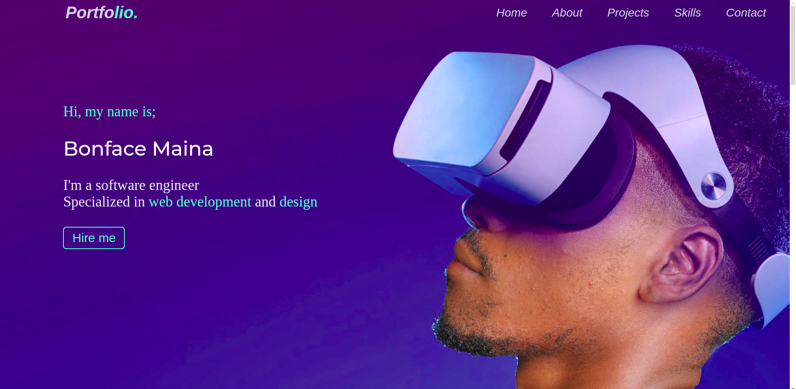

# My Portfolio
This is my Portfolio which shows in detail, my image,name,background,education and the projects I have done in the past.

# Demo
Here is a live working demo: [link](https://bonface221.github.io/Portfolio/))

## Site
## Landing Page

The landing page shows my image and my name as shown below:

 

### Development
Want to contribute? Okay cool;follow the following steps:
<ul>
   <li>Fork the repo</li>
   <li>Create a new branch</li>
   <li>Make appropriate changes in the files</li>
   <li>Add changes to reflect the changes made</li>
   <li>Commit your changes</li>
   <li>Push to a Branch</li>
   <li>Create a Pull request</li>
</ul>

### Bugs
If you find a bug feel free to contact me [email](mainaboniface221@gmail.com)

## Built with
<ul>
  <li> HTML</li>
  <li> CSS</li>
  <li> JavaScript</li>
</ul>

## License
press the link to view the ;
[license](LICENSE)